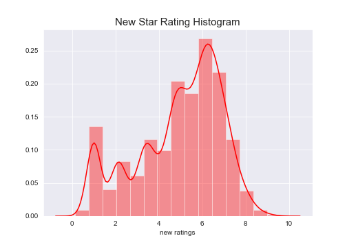
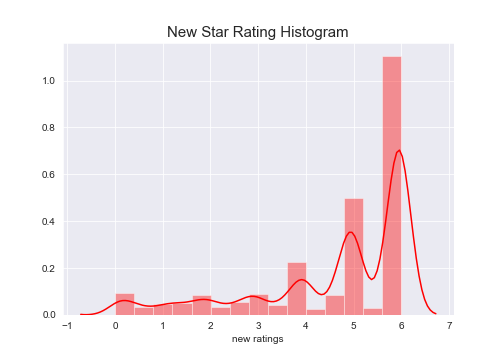
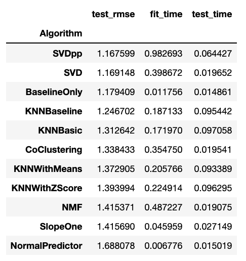

# NYC_fitness_recommender

An NYC based application to provide you with the best recommendations for fitness class, studios, and gyms. From yoga to cycling, swimming to energy healing, its got you covered. I hope you enjoy the final product as much as I have! 

### README Table of Contents
1. [Overview](#overview)
2. [Steps Taken](#steps-taken)
3. [Data Acquisition](#data-acquisition)
4. [Explatory Data Analysis](#explatory-data-analysis)
5. [Natural Language Processing](#natural-language-processing)
6. [Baseline Models and Model Selection](#baseline-models-and-model-selection)
8. [Django App](#django-app)
7. [Key Take Aways](#key-take-aways)
8. [Next Steps](#next-steps)

## Overview:

Fitness is something that is super important to me, so as someone new to NYC it seemed like the perfect opportunity to create a recommender system to find my perfect new class(es). In this project I work to add more details and features into the recommender system to give better results than the ones I've found thus far. 

To add more depth to the reviews, NLP was used for the reviews left and descriptions given by the classes themselves. This project makes use of the python recommender system library _**Surprise**_. In a separate jupyter [notebook]() you can find some information to help with your own project with the library.

All reviews were scraped from **Yelp**, and other information about the classes were gathered using the API. This data was then used to make our preidction using different algorithms in Surprise such as: SVD, SDV++ and BaselineOnly for collaborative fitering.

The first part of this project, is all collaboratibve filtering although there were some models creating using **content based filtering**. The first (current) _final model_ of this project is a content based filtering model using Baseline only with the best hyper-parameters, and filtering for class category (i.e. Cycling, Cardio, Yoga, etc.).

The second part, I cleaned the text data and created a content based filtering model. The Surprise library lacks support for this type of recommender system, so for this I went through the NLP process and then used tf-idf and cosine similarity. This would return gyms/studios that were the most similar based on reviews. 

In the third section, I decided on my current model which takes the best BaselineOnly model from part one, and then filters the results based on the category it falls into (i.e. cycling, pilotes, yoga, etc.). I then created a simple Django webapp that would use some of the form inputs pass it into the serialized model, and query the results with the rest of the user inputs. 

In the next sections, I will outline the steps taken, report findings and share images of the final product--the django web app.

## Steps Taken:

|Part One|
|:-------------:|
|1. Yelp and ClassPass Data aquisition (Selenium and Beautifulsoup)|
|2. Exploratory Data Analysis (EDA) and Data Cleaning|
|3. Create baseline collaborative-filtering models using _Surprise_|

| Part Two |
|:--------:|
| 1. EDA and Cleaning for Text Data                    |
|2. feature engineering, lemming, tokenizing, vectorization, etc.                      |
|3. Create a content based filtering model                                             |

| Part Three |
|:----------:|
|1. Serialize the model |
|2. Create Django WebApp|
|2. Embed model in WebApp|

## Data Acquisition

This was the most time intensive part of the process. This was a combination of webscraping in Selenium and Beautiful Soup, and use of the Yelp API. You can see in my [sraping notebook](https://github.com/elenasm7/NYC_fitness_recommender/blob/master/Scrape_reviews_and_descriptions.ipynb) and [module_functions](https://github.com/elenasm7/NYC_fitness_recommender/blob/master/Mod_5_functions.py) the actual function built to do this process. 

For the webscraping, I grabbed all of the reviewers from the initial start page--in my case __Peloton__. I then checked if the user lived in the NYC area and had at least two reviews of a fitness/health business. If they did, then I would scrape all of their reviews and add it to my dictionary. After scraping, the first ten users that matched my requirements it would move on to the next business in the dictionary that had not been scrapped yet and would continue the process. Just as it would not scrape a business twice, it would not scrape a user twice.

For the Yelp API, after I had the final list of comapnies I used those to return specific information about each. I defined a function that would return a dictionary of the company name, the total number of reviews, it's categories (i.e. cycling, yoga, etc.), and it's average rating.

## Explatory Data Analysis

After collecting all of the data, it was time to [explore](https://github.com/elenasm7/NYC_fitness_recommender/blob/master/exploratory_data_analysis.ipynb). This mostly consisited of looking at the distribution of start ratings, avergae star ratings by users and for businesses, distruibtion of the total number of reviews left my users and for companies.

  

                                      
I was pretty surprised in how positive the reviews skewed. I was predicting the opposite. However, this skew can cause an issue with class imbalance while making predictions for each user. I will revisit this in the NLP section.

  
  

After exploring the data more, I relaized that even though I filtered users and studios by location I didn't filter the reviews I scraped from them. There were many studios/gyms outside of the NYC metro area, so I dropped them. The follium map below shows all of the locations.

  Studio Locations Map
   
  

Now that there was a set number of users and studios/gyms, I could move on to sentiment analysis and NLP.

## Natural Language Processing

### Part 1: Sentiment Analysis

In this section I used the [Vader](http://www.nltk.org/howto/sentiment.html) from the NLTK library to find the sentiment rating of the review to augment the star rating given. The reason this was important was due to the class imbalance of the ratings we started with. More than half of all of the reviews were five-star ratings. This means that the model fit on the data may learn to predict a five-star rating for more people than is actually correct. By augmenting the ratings by the sentiment in the scores we can change the distribution of the scores and make them less imbalanced.

I created a function that would go through each of the reviews and returned the combined sentiment analysis score. The sentiment score was a decimal below +- 1, _it could be positive or negative_. I computed two different augmented ratings. The first I multiplied the original score by the combined sentiment score and then added it to the original score. The results of the new distribution/histogram is shown below:

  

The second method I tried was simply adding the combined score to the original rating. These results again are shown below: 

  

At the time being, even though the first method improved the distribution of scores by a lot it did not have a big impact on my model's error. However, this is somehting I plan to work on and tweak in the coming weeks. More on this in the [Next Steps](#nex-steps) section.

### Part 2: Review Similarity

This section served as a content based recommender system model. I hoped that they user reviews and the term frequency could be telling of the similarities between studios. The first step involves preprocessing the data, which is detailed below, followed by modeling using Cosine Similiarity.

Data Preprocessing Overview for Text Data: 
1. created a function to remove all punction -- found in [module_functions](https://github.com/elenasm7/NYC_fitness_recommender/blob/master/Mod_5_functions.py)
2. lower case all of the words in reviews
4. remove stop words
5. Manually Correct 
6. check for spelling using [SymSpell](https://github.com/wolfgarbe/SymSpell)
7. Compute TF-IDF for each review

Some things to note:
- SymSpell was great. Cost effective (time wise) and more accurate than TextBlob or other spell checkers I've used in the past.
- I originally removed words that were 3 letters or less, as well as stop words, but then realized words like Abs were probably used in reviews and that is something I wanted to keep.
- TF-IDF was computed using Scikit-Learn's feature_extraction.text.TfidfVectorizer

After finding the Term Frequency - Inner Document Frequeny (TF-IDF), I computed the Cosine Similarity Between the review vectors. I did this becuase, words that have a high frequency in a single review, but a lower overall density in all of the reviews combined would possibly make that a characteristic of the studio/gym. So, if _"Abs"_ or _"Cardio"_ had a similar frequency for two separate places then users who enjoy one of those places --_or hate it_-- may feel the same way about the other one. After doing this, I created a function that would return the top 5 similar gyms to any gym I entered. 

Next, I did the same for studios/gyms and their categories--this gave results that I could verify just by looking at them.

## Baseline Models and Model Selection

I quickly ran a baseline model for all of the user-user models in Surprise. The results are below:
 

  

 
As you can see, the top three models (aka the ones with the **smallest RMSE**) were: BaselineOnly, SVD, and SVD++. I moved forward with these three to do hyperparameter tuning using gridsearch.

The top three were: 

#### BaselineOnly

| Hyperparameter  | Best Option |
| ------------- | ------------- |
| Method  | Stocastic Gradient Descent (sgd)  |
| Regularization  | 0.08 |
| Learning Rate | 0.01 |
| Number of Epochs | 3 |

This had a final average **RMSE** (root mean squared error) of: **1.1427**

#### SVD

| Hyperparameter  | Best Option |
| ------------- | ------------- |
| Number of Epochs  | 37  |
| Learning Rate  | 0.008 |
| Regularization | 0.2 | 

This had a final average **RMSE** (root mean squared error) of: **1.14624**

#### SVD++

| Hyperparameter  | Best Option |
| ------------- | ------------- |
| Number of Epochs  | 35  |
| Learning Rate  | 0.007 |
| Regularization | 0.2 | 

This had a final average **RMSE** (root mean squared error) of: **1.1454**

As you can see, all of these had fairly similar average RMSE. However, the deciding factor in this was the cost. **BaselineOnly was the most cost effective** when it came to the time spent fitting and testing the model. So, I decided to go forward with this option.

## Django App

### New York Fittie

I created a small web app using Django. Django is great becuase it will handle so much of the backend. It also it great for a project like this due to it's automation connection to an SQL Database. All the main steps needed to set up the app is below.

Steps:
1. Created an SQLiite database from my scraped reviews DataFrame
2. Replaced the original included database with the one I made, and then performed a migration
3. Serialized the final BaselineOnly model and added it to the app folder
4. Created the function to return the selected number of recommended results

The user input form requires a few itmes: 
- user name
- Gym Category to Filter Results
- Number of Results Wanted
- Minumum Averge Star Rating of the Gym

This would return a filtered list of the top choices for any given user.

Screen shots of the web app view below:

## Key Take Aways
1. The BaselineOnly Model is the most cost efficient model. A few of the options had very similar errors, but this model was the best option with time needed to fit and test as well as error rate. The final RMSE ended up at approximately **1.1427**.
2. The Surprise library does not handle content based filtering. For this I needed to create the TF-IDF vectors for each of the reviews/categories for the studios/gyms and calcualte the cosine similarity for each studio. Becuase this section does not predict the rating a user will give there was not an error rate to compute. However, this step is pretty easy to visually/manually check.
3. Sentiment Analysis for Vader was specifically made for Social Media. You do not need to clean your data before this process.
4. Hybrid Models are much more challenging than the other two alone. There is so much research being done on this front. So, it is very complicated and there is very little documentation on how to implement it.
5. **ALWAYS** do your initial migrations with you SQL database and the Django App, if not this can cause some headaches in the long run.

## Next Steps
1. Do more work with the class embalance of the ratings. Figure out the best method to augment scores using Sentiment Analysis.
2. Combine the Content Based and the Collaborative Filtering Models to create a hybrid model.
3. Use the themes identified by TF-IDF of the reviews to see what users are talking about. Possibly add this as the filter.
4. Allow for cold start while using the Django App. Users should not need to enter their user names. 
5. Continuation of 4, update the user names in DB.

