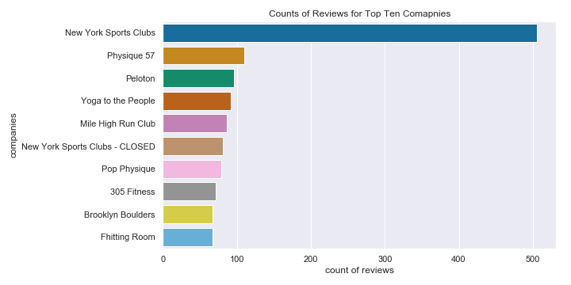

# NYC_fitness_recommender

An NYC based application to provide you with the best recommendations for fitness class, studios, and gyms. From yoga to cycling, swimming to energy healing, its got you covered. I hope you enjoy the final product as much as I have! 

 

### README Table of Contents
1. [Overview](#overview)
2. [Steps Taken](#steps-taken)
3. [Data Acquisition](#data-acquisition)
4. [Explatory Data Analysis](#explatory-data-analysis)
5. [Natural Language Processing](#natural-language-processing)
6. [Baseline Models and Model Selection](#baseline-models-and-model-selection)
7. [Key Take Aways](#key-take-aways)
8. [Next Steps](#next-steps)

## Overview:

Fitness is something that is super important to me, so as someone new to NYC it seemed like the perfect opportunity to create a recommender system to find my perfect new class(es). In this project I work to add more details and features into the recommender system to give better results than the ones I've found thus far. 

To add more depth to the reviews, NLP was used for the reviews left and descriptions given by the classes themselves. This project makes use of the python recommender system library _**Surprise**_. In a separate jupyter [notebook]() you can find some information to help with your own project with the library.

All reviews were scraped from **Yelp**, and other information about the classes were gathered using the API. This data was then used to make our preidction using different algorithms in Surprise such as: SVD, SDV++ and BaselineOnly for collaborative fitering.

The first part of this project, is all collaboratibve filtering although there were some models creating using **content based filtering**. The first (current) _final model_ of this project is a content based filtering model using Baseline only with the best hyper-parameters, and filtering for class category (i.e. Cycling, Cardio, Yoga, etc.).

The second part, I cleaned the text data and created a content based filtering model. The Surprise library lacks support for this type of recommender system, so for this I went through the NLP process and then used tf-idf and cosine similarity. This would return gyms/studios that were the most similar based on reviews. 

In the third section, I decided on my current model which takes the best BaselineOnly model from part one, and then filters the results based on the category it falls into (i.e. cycling, pilotes, yoga, etc.). I then created a simple Django webapp that would use some of the form inputs pass it into the serialized model, and query the results with the rest of the user inputs. 

In the next sections, I will outline the steps taken, report findings and share images of the final product--the django web app.

## Steps Taken:

|Part One|
|:-------------:|
|1. Yelp and ClassPass Data aquisition (Selenium and Beautifulsoup)|
|2. Exploratory Data Analysis (EDA) and Data Cleaning|
|3. Create baseline collaborative-filtering models using _Surprise_|

| Part Two |
|:--------:|
| 1. EDA and Cleaning for Text Data                    |
|2. feature engineering, lemming, tokenizing, vectorization, etc.                      |
|3. Create a content based filtering model                                             |

| Part Three |
|:----------:|
|1. Serialize the model |
|2. Create Django WebApp|
|2. Embed model in WebApp|

## Data Acquisition

This was the most time intensive part of the process. This was a combination of webscraping in Selenium and Beautiful Soup, and use of the Yelp API. You can see in my [sraping notebook](https://github.com/elenasm7/NYC_fitness_recommender/blob/master/Scrape_reviews_and_descriptions.ipynb) and [module_functions](https://github.com/elenasm7/NYC_fitness_recommender/blob/master/Mod_5_functions.py) the actual function built to do this process. 

For the webscraping, I grabbed all of the reviewers from the initial start page--in my case __Peloton__. I then checked if the user lived in the NYC area and had at least two reviews of a fitness/health business. If they did, then I would scrape all of their reviews and add it to my dictionary. After scraping, the first ten users that matched my requirements it would move on to the next business in the dictionary that had not been scrapped yet and would continue the process. Just as it would not scrape a business twice, it would not scrape a user twice.

For the Yelp API, after I had the final list of comapnies I used those to return specific information about each. I defined a function that would return a dictionary of the company name, the total number of reviews, it's categories (i.e. cycling, yoga, etc.), and it's average rating.

## Explatory Data Analysis

After collecting all of the data, it was time to [explore](https://github.com/elenasm7/NYC_fitness_recommender/blob/master/exploratory_data_analysis.ipynb). This mostly consisited of looking at the distribution of start ratings, avergae star ratings by users and for businesses, distruibtion of the total number of reviews left my users and for companies.

  

                                      
I was pretty surprised in how positive the reviews skewed. I was predicting the opposite. However, this skew can cause an issue with class imbalance while making predictions for each user. I will revisit this in the NLP section.

  
  

After exploring the data more, I relaized that even though I filtered users and studios by location I didn't filter the reviews I scraped from them. There were many studios/gyms outside of the NYC metro area, so I dropped them. The follium map below shows all of the locations.

  Studio Locations Map
   
  

## Natural Language Processing

### Part 1: Sentiment Analysis

In this section I used the [Vader](http://www.nltk.org/howto/sentiment.html) from the NLTK library to find the sentiment rating of the review to augment the star rating given. The reason this was important was due to the class imbalance of the ratings we started with. More than half of all of the reviews were five-star ratings. This means that the model fit on the data may learn to predict a five-star rating for more people than is actually correct. By augmenting the ratings by the sentiment in the scores we can change the distribution of the scores and make them less imbalanced.

Steps of how I did this....

### Part 2: Review Similarity

Data Preprocessing Overview for Text Data: 
1. created a function to remove all punction -- found in [module_functions] (https://github.com/elenasm7/NYC_fitness_recommender/blob/master/Mod_5_functions.py)
2. lower case all of the words in reviews
3. remove all words shorter than 3 characters
4. remove stop words
5. Manually Correct 
6. check for spelling using [SymSpell](https://github.com/wolfgarbe/SymSpell)
7. TF-IDF
8. Cosine Similarity Between Review TF-IDF Vectors

## Baseline Models and Model Selection

## Key Take Aways

## Next Steps

